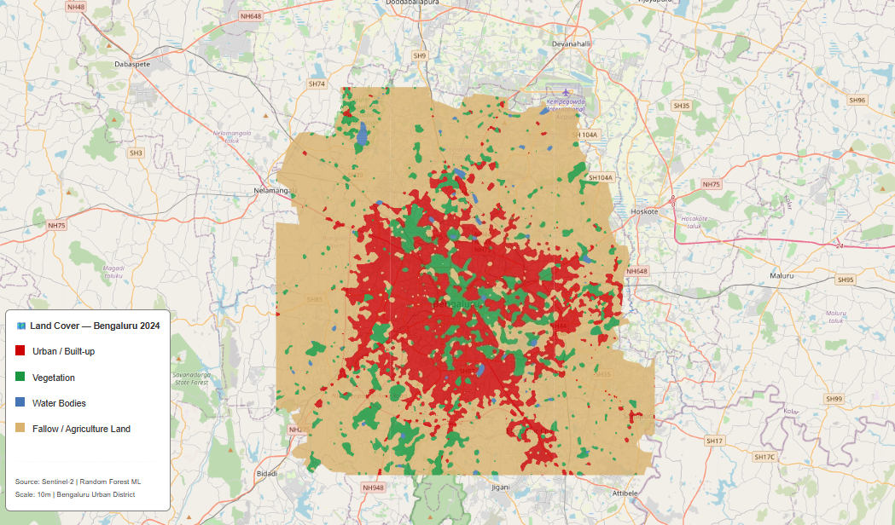

# 🏙️ Bengaluru Land Cover Classification 2024
### Machine Learning + Google Earth Engine + Sentinel-2

---

## 📌 Project Overview
Land Use Land Cover (LULC) classification of Bengaluru Urban District 
using Random Forest machine learning on Sentinel-2 satellite imagery 
processed via Google Earth Engine.

## 🗺️ Map

## 🎯 Land Cover Classes
| Class | Description |
|---|---|
| 🔴 Urban / Built-up | Roads, buildings, concrete surfaces |
| 🟢 Vegetation | Parks, forests, mixed cropland |
| 🔵 Water Bodies | Lakes, reservoirs, wetlands |
| 🟫 Fallow / Agriculture | Uncultivated farmland, open soil |

## 🛠️ Tech Stack
- **Google Earth Engine** — cloud satellite data processing
- **Sentinel-2 L2A** — 10m resolution imagery (Jan–Mar 2024)
- **Random Forest** — scikit-learn classifier
- **Python** — GeoPandas, Pandas, Matplotlib

## 📊 Model Performance
- Training samples: 800 pixels (200 per class)
- Spectral features: B2, B3, B4, B8, B11, B12, NDVI, NDBI, MNDWI

## ⚠️ Limitations
- Accuracy may be optimistic due to spatial autocorrelation in training samples
- Agriculture and Vegetation merged due to spectral similarity in dry season
- Fallow land dominant in peri-urban areas due to seasonal cultivation patterns
  
## Author
Salwin M S | GIS Analyst | TUM graduate | Kerala, India
